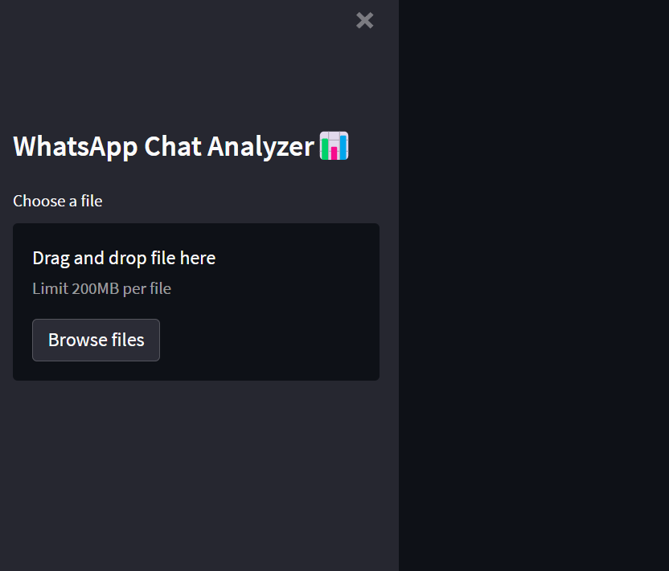

Project Understanding

The analysts organized those tasks and activities around the six phases of the data analysis process:

1-Ask

2-Prepare

3-Process

4-Analyze

5-Share

6-Act

 *WhatsApp Chat Analyzer*

This project is a  *Whatsapp Chat Analyzer* project where user can export either personal or group chat in text file and save it in its system and when uploading on application it gives you complete statistics of conversation between or among people and gives user analysis report which he/she may analyse and use for future use.

*Some parameter of Analyzer include*

1-Wordcloud,

2-Monthly- Timeline,

3- Daily_timeline,

4-Activity-map,

5-most common words using in chat(Top 25),

6-emoji Analysis,

7- Heat-Map

-Application runs on streamlit( An open-source platform for machine learning and data science teams to create data applications with python) and deployed on heroku 

https://chat-analysis-ayushjain.herokuapp.com/

Front view of an application-

## 🧮 Like It? Then why to wait😃
- Fork the repository
- Clone your forked repository using terminal or gitbash.
- Make changes to the cloned repository
- Add, Commit and Push
- Then in Github, in your cloned repository find the option to make a pull request
